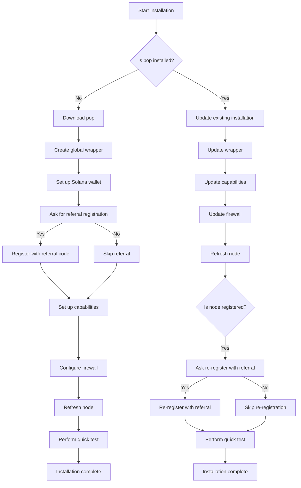

# Pipe POP Node Management Toolkit Installation Guide

This script automates the installation and configuration of the Pipe POP caching node, making it easy to set up and manage your node with Surrealine's toolkit.

## Features

### 1. Automated Installation
- Downloads and installs the latest Pipe POP binary
- Creates a global `pop` command accessible from anywhere
- Sets up proper permissions and capabilities
- Configures firewall rules automatically

### 2. System Configuration
- Creates system-wide configuration files
- Sets up proper directory structure
- Configures port bindings (80, 443, 8003)
- Establishes proper file permissions

### 3. Node Registration
- Automatically registers new nodes with Surrealine's referral code
- Ensures proper node configuration
- Sets up initial node status

### 4. Security Features
- Sets proper file permissions
- Configures capabilities for port binding
- Establishes secure firewall rules

## Installation Process



The script performs the following steps:

1. **Initial Check**
   - Verifies if pop is already installed
   - Checks for existing configuration files

2. **Binary Installation**
   - Downloads the latest Pipe POP binary
   - Makes the binary executable
   - Creates necessary directories
   - Moves the binary to `/opt/pop`

3. **Global Command Setup**
   - Creates a wrapper script at `/usr/local/bin/pop`
   - Ensures configuration file availability
   - Makes the command globally accessible

4. **Solana Wallet Setup**
   - Prompts for Solana wallet public key
   - Sets up wallet for receiving token payments
   - Saves wallet configuration

5. **Referral Registration**
   - Asks if user wants to register with Surrealine's referral code
   - Registers node with referral code if requested
   - For existing nodes: Offers option to re-register with referral code

6. **Node Registration**
   - Registers the node with Surrealine's referral code (only for new nodes)
   - Sets up initial node status
   - Configures node settings

7. **Final Setup**
   - Refreshes the node configuration
   - Displays completion message
   - Provides support information

8. **Quick Test**
   - Tests egress connectivity
   - Verifies node status
   - Checks node points
   - Ensures everything is working correctly

## Referral Program

The script offers referral registration options:

1. For new installations:
   - Prompts to register with Surrealine's referral code
   - Explains benefits of joining the referral program
   - Allows skipping if preferred

2. For existing nodes:
   - Detects if node is already registered
   - Offers option to re-register with Surrealine's referral code
   - Preserves existing configuration if re-registration is skipped

## Solana Wallet Setup

During installation, you'll be prompted to enter your Solana wallet public key. This is optional but recommended if you want to:

1. Receive token payments for your node's services
2. Track your earnings
3. Manage node rewards

If you don't have a Solana wallet, you can:
1. Skip the wallet setup during installation
2. Set up a wallet later using: `pop --pubKey <YOUR_WALLET>`
3. Follow our guide to create a Solana wallet: https://docs.surrealine.com/wallet-guide

## Update Process

If a node is already running:

1. The script will detect the existing installation
2. It will update the global command wrapper
3. It will refresh the node's capabilities and firewall rules
4. It will skip the registration process (since the node is already registered)
5. It will refresh the node configuration

This ensures that your existing node configuration is preserved while updating to the latest version and maintaining all security settings.

## Usage

1. Navigate to your node's working directory:
```bash
cd /path/to/your/node
cd /var/lib/pop  # Example location
```

2. Run the installation script:
```bash
./install-pop.sh
```

## Requirements

- Linux system with sudo access
- Internet connection for downloads
- UFW firewall (for port configuration)
- At least 4GB of RAM
- At least 100GB of disk space

## Support

For support and updates, visit:
https://surrealine.com

## License

This project is open source and maintained by Surrealine. Contributions are welcome!

## Contributing

1. Fork the repository
2. Create your feature branch (`git checkout -b feature/AmazingFeature`)
3. Commit your changes (`git commit -m 'Add some AmazingFeature'`)
4. Push to the branch (`git push origin feature/AmazingFeature`)
5. Open a Pull Request

## Community

Join our community on Discord: https://discord.gg/surrealine

---

Thank you for using the Pipe POP Node Management Toolkit from Surrealine!
